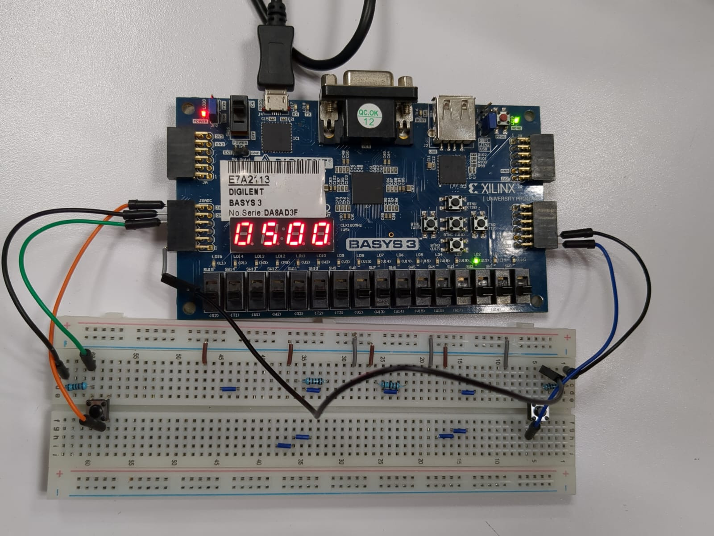

# 1D-VHDL-Pong
Hands-on 1D Pong game development using VHDL and the Basys 3, perfect for beginners in FPGA design.



# Preperations and Usage 
This 1D Pong game is played by two players, each controlling one push button. The game itself is played on the LEDs of the FPGA (Basys-3) board and the goal is to prevent the "LED ball" from reaching the end of your side.

## Hardware
* FPGA Board (i.e. Basys-3)
* 2x Push Buttons and 2x Pull Down Resistors (Optional)

Depending on your specific FPGA board you need to adjust the constrains, as this project was developed using the Basys-3 Board.

### Options 1: Using buttons on the board
You can test the game using the built-in buttons on the Basys 3 board, but note that it’s less user-friendly because the buttons are not positioned on the respective player's side.  

To use the internal buttons the  `.xdc` file has to be edited in the following way:

1. uncomment the following
```
set_property PACKAGE_PIN U18 [get_ports btnC]
	set_property IOSTANDARD LVCMOS33 [get_ports btnC]
set_property PACKAGE_PIN T18 [get_ports btnU]
	set_property IOSTANDARD LVCMOS33 [get_ports btnU]	
```
2. comment the following:
```
#set_property PACKAGE_PIN J3 [get_ports {btn_player2}]
	#set_property IOSTANDARD LVCMOS33 [get_ports {btn_player2}]

#set_property PACKAGE_PIN M2 [get_ports {btn_player1}]
	#set_property IOSTANDARD LVCMOS33 [get_ports {btn_player1}]
```

### Options 2: Using external buttons

If you'd prefer to use external buttons, leave the constraints as they are in the example.
In this case you also have to add the button circuits to Power, Ground and especially the GPIOs to controll the players as shown.


## Game Rules
1. On person controls one button.
2. By pressing the button the player can bounce the ball to the other side.
3. If a player presses to late the opponent gains a point and the ball restarts from the center.
4. The later a player presses the stronger the speed of the bounced ball is, making it harder to defend.
5. The player that reaches 9 points first wins.

# Setup (using [Vivado](https://www.xilinx.com/support/download.html))
1. Code and Hardware preparation (listed above)
2. Create the Vivado project for your FPGA, import the sources and constraints(`.xdc`)
3. Generate the bitstream for your Board
4. Upload the Bitstream / Program the Device
5. Enjoy

# Documentation
For more detailed information on how it works see: [documentation.md](./documentation.md).

# Credits
This project was created by:
* Adrián Rodríguez Godínez - 179784
* Ian Carlo Vicente Aburto - 182598
* Ana Paola Vargas González - 180549
* Philip Dell - 186247
