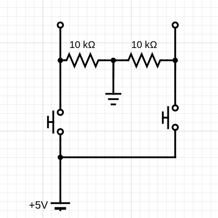

# 1D-VHDL-Pong
Hands-on 1D Pong game development using VHDL and the Basys 3, perfect for beginners in FPGA design.

# Preperations and Usage 
The game is played with two players, each controlling one push button. The game itself is played on the LEDs of the FPGA (Basys-3) board. The goal is to not let the 'LED ball' get to the end of your side by hitting the button in time which will bounce the ball into the other direction.

## Hardware
On the hardware side you need for one the FPGA board, and optionally some pushbuttons and pulldown resistors. Additionally, depending on you specific FPGA board you need to adjust the constrains, as the example here is meant for the Basys-3 Board.

### Options 1: Using buttons on the board
This is possible to test the program, however it is less user friendly as the space for the buttons is smaller and the buttons are not on the respective playerside.
To use the internal buttons the  `.xdc` file has to be edited in the following way:

First uncomment the following
```
set_property PACKAGE_PIN U18 [get_ports btnC]
	set_property IOSTANDARD LVCMOS33 [get_ports btnC]
set_property PACKAGE_PIN T18 [get_ports btnU]
	set_property IOSTANDARD LVCMOS33 [get_ports btnU]	
```

Second comment the following:
```
#set_property PACKAGE_PIN J3 [get_ports {btn_player2}]
	#set_property IOSTANDARD LVCMOS33 [get_ports {btn_player2}]
```
AND
```
#set_property PACKAGE_PIN M2 [get_ports {btn_player1}]
	#set_property IOSTANDARD LVCMOS33 [get_ports {btn_player1}]
```

### Options 2: Using external buttons

You can leave the constraints as they are, but you need to add the button circuits.




## Game Rules
1. On person controls one button.
2. By pressing the button the player can bounce the ball to the other side.
3. If a player presses to late the opponent gains a point and the ball restarts from the center.
4. The later a player presses the stronger the speed of the bounced ball is, making it harder to defend.
5. The player that reaches 9 points first wins.

# Setup
Once all the files are prepared we can start the process of making it run on the board.
First, as the game is intended for a FPGA board (`Basys-3` in particular) the source files have to be brought into a format that the board can run.
We used [Vivado](https://www.xilinx.com/support/download.html) for this. After creating a new project, selecting our board and importing the sources + constraints (`.xdc`) we were able to generate the binary bitstream for the board.
After that we uploaded/program the board and started enjoying the game.

# Credits
This project was created by:
* Adrián Rodríguez Godínez - 179784
* Ian Carlo Vicente Aburto - 182598
* Ana Paola Vargas González - 180549
* Philip Dell - 186247
